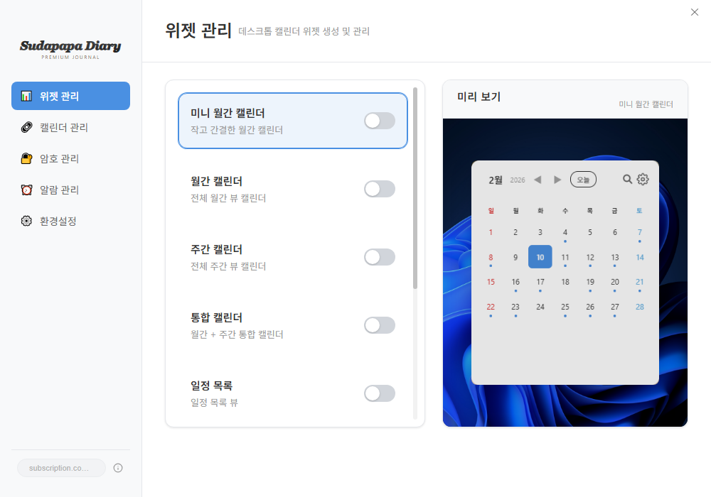
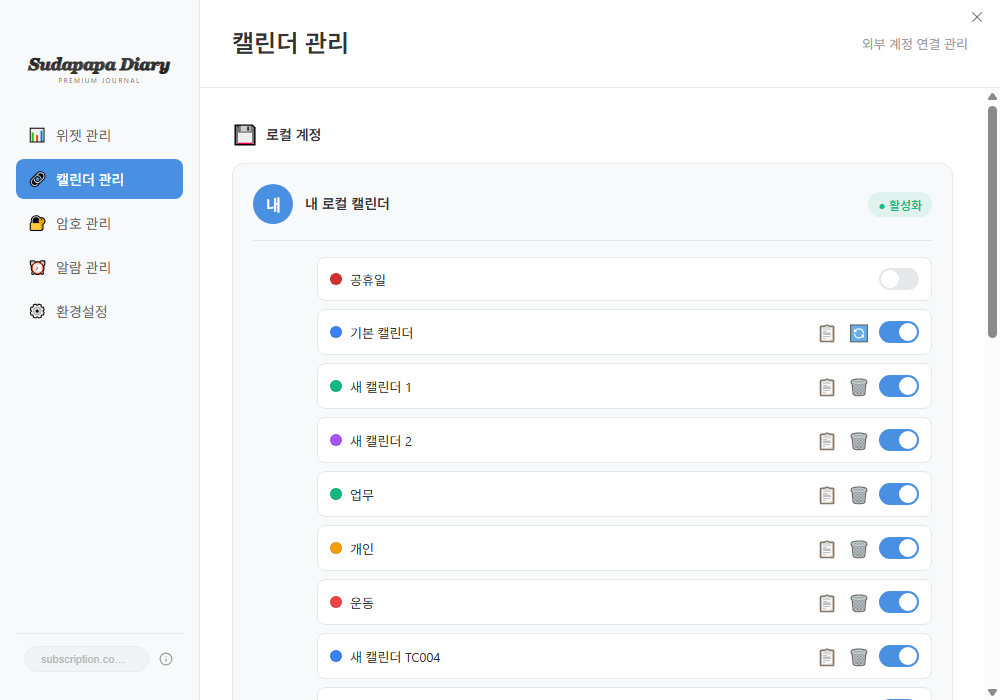
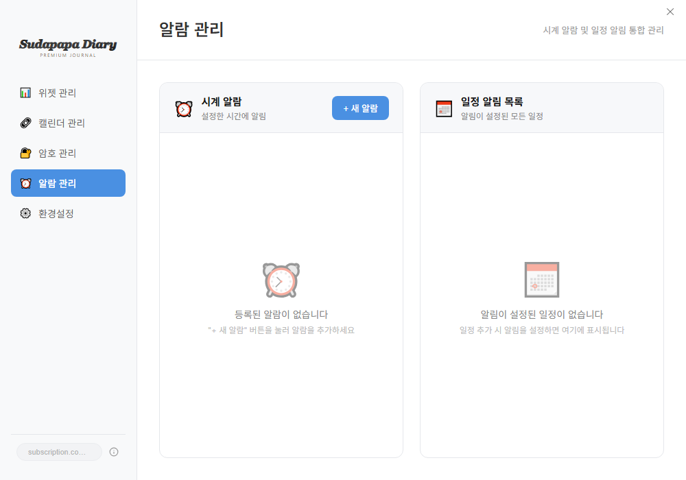
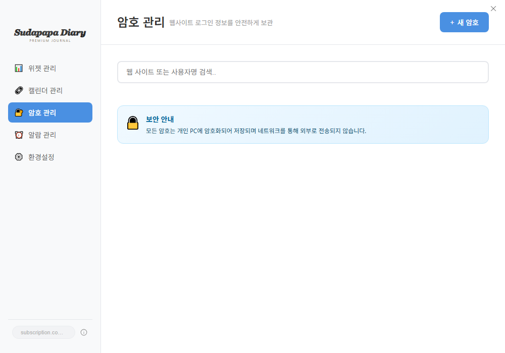
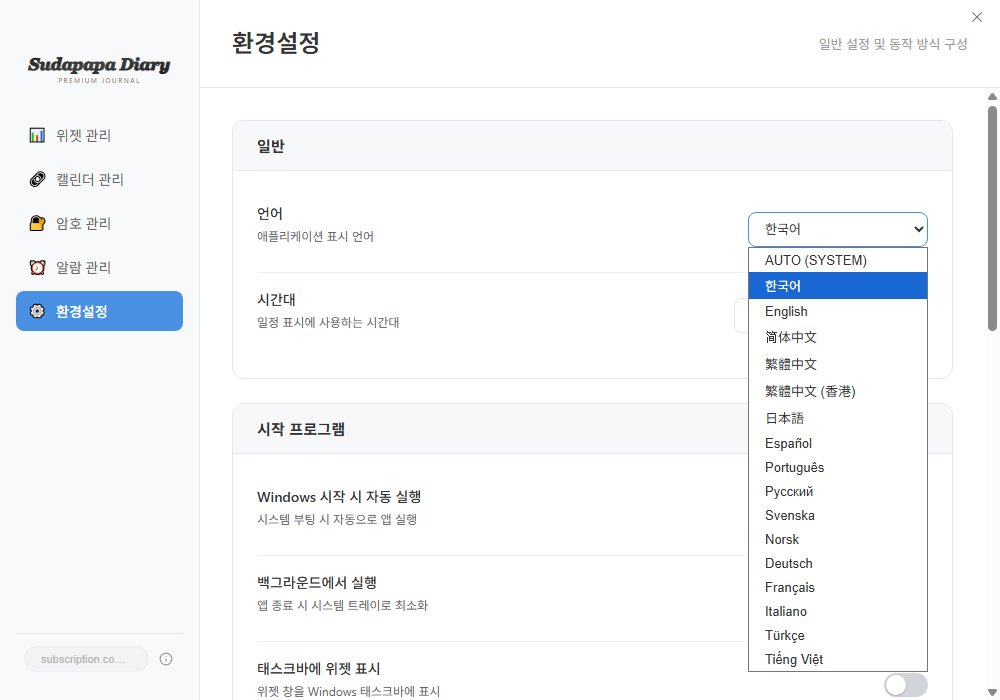
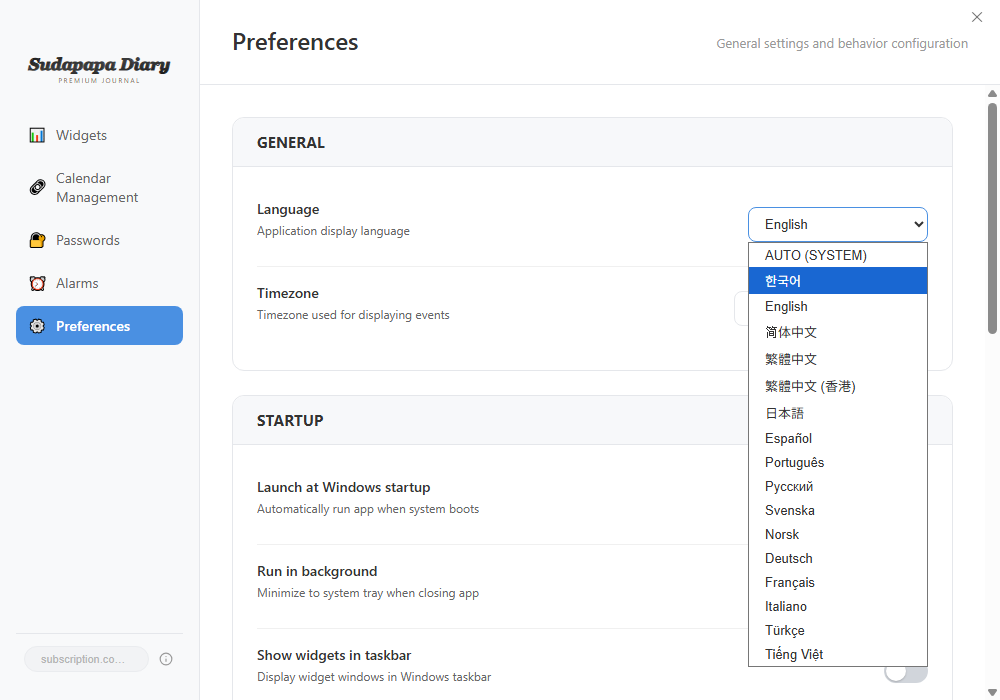
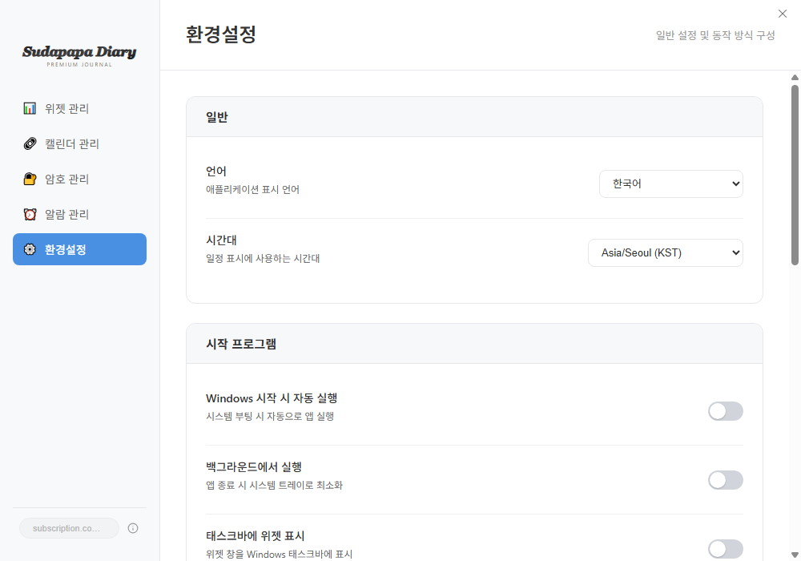
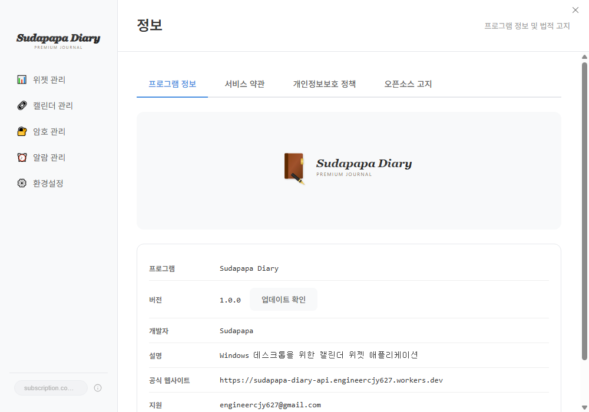

# Sudapapa Diary

### PREMIUM JOURNAL - Windows Desktop Widget & Diary Application

---

## 당신의 데스크톱을 스마트하게, 하루를 체계적으로

**Sudapapa Diary**는 Windows 데스크톱에 상주하며 일정, 메모, 할 일, 비밀번호까지 한 곳에서 관리하는 올인원 위젯 애플리케이션입니다. 복잡한 클라우드 서비스 없이, 내 PC에서 안전하고 빠르게 일상을 관리하세요.

---

## 핵심 기능

### 1. 데스크톱 위젯 시스템

바탕화면에 직접 배치되는 9가지 위젯으로 한눈에 일정을 확인하세요.

| 위젯 | 설명 |
|------|------|
| **미니 월간 캘린더** | 작고 간결한 월간 달력 - 바탕화면 한 켠에 항상 표시 |
| **월간 캘린더** | 상세 일정이 표시되는 풀사이즈 월간 뷰 |
| **주간 캘린더** | 시간대별 일정 확인이 가능한 주간 뷰 |
| **통합 캘린더** | 월간 + 주간을 한 화면에 통합 |
| **일정 목록** | 다가오는 일정을 리스트 형태로 확인 |
| **칸반 보드** | 드래그 앤 드롭으로 할 일 관리 |
| **메모** | 마크다운 지원 메모 위젯 |
| **빠른 접근** | 자주 사용하는 앱/폴더 바로가기 |
| **비밀번호 관리** | 로컬 암호화 비밀번호 빠른 복사 |

위젯은 대시보드에서 토글 한 번으로 켜고 끌 수 있으며, 바탕화면 위 원하는 위치에 자유롭게 배치할 수 있습니다.

---

### 2. Google Calendar 연동

Google 계정과 연결하면 Google Calendar의 일정이 데스크톱 위젯에 실시간으로 표시됩니다.

- Google Calendar 일정을 로컬로 가져오기 (Import)
- 로컬 일정을 Google Calendar로 내보내기 (Export)
- 여러 캘린더 동시 관리 (업무, 개인, 운동 등)
- ICS 파일 가져오기/내보내기 지원

---

### 3. 스마트 알림 시스템

중요한 일정과 시간을 놓치지 않도록 두 가지 알림으로 알려드립니다.

<table>
<tr>
<td width="50%" align="center">

**일정 알림**

일정 시작 전 원하는 시간에 팝업으로 알림

</td>
<td width="50%" align="center">

**시계 알람**

매일 반복되는 기상 알람, 회의 알람 등 설정

</td>
</tr>
</table>

---

### 4. 비밀번호 관리자

웹사이트 로그인 정보를 내 PC에 안전하게 보관합니다.

- 모든 비밀번호는 **로컬 암호화** 저장
- 네트워크를 통해 외부로 전송되지 않음
- 클릭 한 번으로 비밀번호 복사
- 위젯에서 바로 빠른 복사 가능

---

### 5. 16개 언어 지원

한국어를 포함한 16개 언어를 지원하여 전 세계 어디서나 사용할 수 있습니다.

**지원 언어:** 한국어, English, 简体中文, 繁體中文, 繁體中文(香港), 日本語, Espanol, Portugues, Русский, Svenska, Norsk, Deutsch, Francais, Italiano, Turkce, Tieng Viet

<table>
<tr>
<td width="50%" align="center">

**한국어 UI**

</td>
<td width="50%" align="center">

**English UI**

</td>
</tr>
</table>

---

### 6. 풍부한 환경설정

사용자의 취향과 업무 스타일에 맞게 모든 것을 커스터마이징할 수 있습니다.

- **시작 프로그램 등록** - Windows 부팅 시 자동 실행
- **백그라운드 실행** - 시스템 트레이에서 조용히 상주
- **위젯 테마** - 라이트/다크/커스텀 테마 지원
- **위젯 투명도** - 바탕화면과 자연스러운 조화
- **시간대 설정** - 해외 일정도 정확하게 관리
- **데이터 백업/복원** - 비밀번호 보호 백업 파일 생성

---

## 왜 Sudapapa Diary인가?

### 프라이버시 우선

| 항목 | Sudapapa Diary | 클라우드 서비스 |
|------|---------------|--------------|
| 데이터 저장 위치 | **내 PC (로컬)** | 외부 서버 |
| 비밀번호 암호화 | **로컬 암호화** | 서버 암호화 |
| 인터넷 필수 여부 | **오프라인 사용 가능** | 인터넷 필수 |
| 데이터 소유권 | **100% 사용자** | 서비스 약관 종속 |
| 가격 | **합리적 구독제** | 고가 월정액 |

### 가볍고 빠르게

- 시스템 트레이에 상주하며 리소스를 최소한으로 사용
- 위젯은 바탕화면에 직접 표시되어 앱 전환 없이 확인
- QuickAdd 단축키(`Ctrl+Shift+A`)로 어디서든 빠른 일정 추가

### 올인원 데스크톱 도구

하나의 앱으로 캘린더, 메모, 할 일, 비밀번호, 알람을 모두 관리합니다. 여러 앱을 설치할 필요가 없습니다.

---

## 제품 정보

| 항목 | 내용 |
|------|------|
| **프로그램** | Sudapapa Diary |
| **버전** | 1.0.0 |
| **개발** | Sudapapa |
| **플랫폼** | Windows 10 / 11 |
| **설치 방식** | NSIS 설치 프로그램 (원클릭 설치) |
| **가격** | 월간 / 연간 / 영구 라이선스 |

---

## 빠른 시작 가이드

### 1단계: 설치
`SudapapaDiary-Setup.exe`를 실행하고 원클릭으로 설치합니다.

### 2단계: 위젯 활성화
대시보드에서 원하는 위젯의 토글을 켜면 바탕화면에 위젯이 나타납니다.

### 3단계: 일정 추가
캘린더 위젯에서 날짜를 클릭하거나, `Ctrl+Shift+A`로 QuickAdd를 열어 일정을 추가합니다.

### 4단계: Google 연동 (선택)
계정 관리에서 Google 로그인을 하면 Google Calendar 일정이 자동으로 동기화됩니다.

---

## 키보드 단축키

| 단축키 | 기능 |
|--------|------|
| `Ctrl+Shift+A` | QuickAdd (빠른 일정 추가) |
| `Ctrl+Shift+D` | 대시보드 열기/닫기 |
| `ESC` | 현재 팝업 닫기 |

---

**Sudapapa Diary** - 당신의 데스크톱, 당신의 일정, 당신의 방식으로.

*Windows 데스크톱을 위한 최고의 위젯 다이어리*

